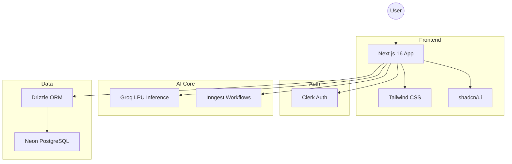
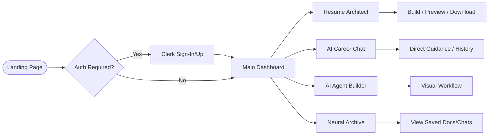

# 🚀 Saarthi

**Saarthi** is a premium, AI-driven career orchestration platform designed to empower professionals with state-of-the-art tools for career growth, resume architecture, and personalized AI mentorship.

---

## ✨ Features

### 🛠️ Neural Resume Architect (New!)
- **Dynamic Workspace**: A high-performance, resizable three-pane editor powered by `react-resizable-panels`.
- **Intelligent Mini-Sidebar**: Responsive navigation that collapses into a sleek icon-only strip at <10% width.
- **Live Diagnostic Preview**: Real-time rendering of your resume as you build, with glassmorphism overlays.
- **PDF Finalization**: High-quality PDF export for immediate professional use.

### 🤖 Intelligent AI Agents
- **AI Career Coach**: Specialized chat interface for career guidance using advanced LLM reasoning.
- **Custom Agent Builder**: A visual workflow builder for creating specialized AI personas.
- **Groq-Accelerated Reasoning**: Ultra-fast AI responses powered by Groq's LPU™ Inference Engine.

### 📋 Precision Career Tools
- **Deep Resume Analyzer**: Upload and scan resumes for actionable neural insights and ATS optimization.
- **Dynamic Roadmap Generator**: algorithmic career path plotting based on personal goals.
- **Smart History Archive**: A centralized "Neural Archive" for managing all saved iterations and chats.

### 🎨 Design Philosophy
- **Premium Aesthetics**: A custom-crafted dark theme featuring cyan/blue gradients and high-contrast typography.
- **Glassmorphism Core**: Modern UI using backdrop blurs, subtle borders, and depth-focused layouts.
- **Micro-Animations**: Smooth, high-frame-rate transitions for a fluid professional experience.

---

## 🗺️ Visual Architecture

### 🏗️ System Architecture


### 🔄 User Flow


---

## 🛠️ Tech Stack

### Frontend Architecture
- **Framework**: [Next.js 16 (Canary/Latest)](https://nextjs.org/)
- **Core**: React 19, TypeScript
- **Styling**: Tailwind CSS (PostCSS 8+)
- **Components**: shadcn/ui (Radix UI Primitives)
- **Icons**: Lucide React

### Backend & Orchestration
- **Identity**: [Clerk](https://clerk.dev/) (Enterprise-grade Auth)
- **Engine**: Groq API (Primary AI Engine)
- **Data Layer**: Neon PostgreSQL with Drizzle ORM
- **Workflow**: [Inngest](https://www.inngest.com/) (Reliable background functions)

---

## 🚀 Getting Started

### Prerequisites
- Node.js 20+
- Git
- API keys for Clerk, Neon, Groq, and Inngest

### Installation

1. **Clone the repository**
   ```bash
   git clone https://github.com/divysaxena24/Saarthi.git
   cd saarthi
   ```

2. **Install dependencies**
   ```bash
   npm install
   ```

3. **Configure Environment Variables**
   Create a `.env` file in the root directory and add your credentials:
   ```env
   NEXT_PUBLIC_NEON_DB_CONNECTION_STRING=your_neon_string
   NEXT_PUBLIC_CLERK_PUBLISHABLE_KEY=your_clerk_key
   CLERK_SECRET_KEY=your_clerk_secret
   GROQ_API_KEY=your_groq_key
   INNGEST_SIGNING_KEY=your_inngest_key
   ```

4. **Run Development Server**
   ```bash
   npm run dev
   ```

---

## 🤝 Contributing

Saarthi is under active evolution. Contributions that enhance the neural architecture or design system are welcome!

1. Fork the Project
2. Create your Feature Branch (`git checkout -b feature/NeuralEnhancement`)
3. Commit your Changes (`git commit -m 'Add neural insight layer'`)
4. Push to the Branch (`git push origin feature/NeuralEnhancement`)
5. Open a Pull Request

---

## 📄 License
Licensed under the MIT License. See `LICENSE` for more information.
