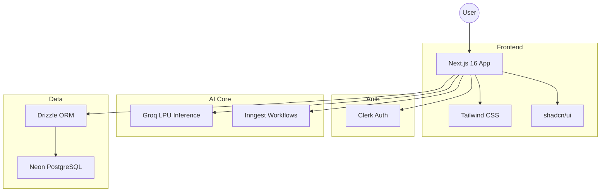

# 🚀 Saarthi: The AI Career Navigator

**Saarthi** is a premium, AI-driven career orchestration platform designed to empower professionals with state-of-the-art tools for career growth, resume architecture, and personalized AI mentorship.

[](https://github.com/knoxiboy/Saarthi)
[](https://aws.amazon.com/amplify/)
[](https://nextjs.org/)

---

## 📖 Documentation
Detailed project documentation is available in the following files:
- [Requirements Specification](requirements.md) - Functional and Non-functional goals.
- [Design Architecture](design.md) - Technical stack and UI/UX philosophy.

---

## ✨ Features

### 🛠️ Neural Resume Architect
- **Dynamic Workspace**: A high-performance, resizable three-pane editor powered by `react-resizable-panels`.
- **Intelligent Mini-Sidebar**: Responsive navigation that collapses into a sleek icon-only strip at <10% width.
- **Live Diagnostic Preview**: Real-time rendering of your resume as you build, with glassmorphism overlays.
- **PDF Finalization**: High-fidelity PDF export with professional typography and layout.
- **Writing Studio**: Specialized tools for Cover Letters, SOPs, and Motivation Letters.

### 🤖 Intelligent AI Agents
- **AI Career Coach**: Specialized chat interface for career guidance using advanced LLM reasoning (Groq).
- **Custom Agent Builder**: A visual workflow builder for creating specialized AI personas.
- **Groq-Accelerated Reasoning**: Ultra-fast AI responses powered by Groq's LPU™ Inference Engine.

### 📋 Precision Career Tools
- **Deep Resume Analyzer**: Upload PDF resumes for actionable neural insights and ATS optimization.
- **Dynamic Roadmap Generator**: Algorithmic career path plotting based on personal goals and timelines.
- **Premium Course Forge**: Generate full-length courses with projects and curated videos.
- **Smart History Archive**: A centralized "Neural Archive" for managing all saved iterations, roadmaps, and chats.

---

## 🏗️ System Architecture


```mermaid
graph TD
    User((User)) --> NextJS[Next.js 16 App]
    subgraph Frontend
        NextJS --> Tailwind[Tailwind CSS]
        NextJS --> Radix[shadcn/ui]
    end
    subgraph Auth
        NextJS --> Clerk[Clerk Auth]
    end
    subgraph "AI Core"
        NextJS --> Groq[Groq LPU Inference]
        NextJS --> Inngest[Inngest Workflows]
    end
    subgraph Data
        NextJS --> Drizzle[Drizzle ORM]
        Drizzle --> Neon[Neon PostgreSQL]
    end
```

---

## 🛠️ Tech Stack

- **Framework**: [Next.js 16](https://nextjs.org/) (React 19, TypeScript)
- **Styling**: Tailwind CSS, Framer Motion
- **Database**: Neon (PostgreSQL)
- **ORM**: Drizzle
- **Auth**: [Clerk](https://clerk.dev/)
- **AI**: Groq (Primary), AWS Bedrock (Course Synthesis)
- **Monitoring**: Inngest

---

## 🚀 Installation & Setup

1. **Clone the repository**
   ```bash
   git clone https://github.com/knoxiboy/Saarthi.git
   cd saarthi
   ```

2. **Install dependencies**
   ```bash
   npm install
   ```

3. **Configure Environment Variables**
   Create a `.env` file from the instructions in [Setup Guide](requirements.md#4-technical-constraints).

4. **Initialize Database**
   ```bash
   npx drizzle-kit push
   ```

5. **Run Development Server**
   ```bash
   npm run dev
   ```

---

## 📄 License
Licensed under the MIT License. See `LICENSE` for more information.
